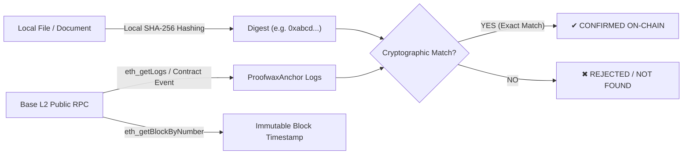

# Proofwax Independent Cryptographic Verifier

[](LICENSE)
[](https://base.org)
[](#)

> **Trustless, decentralized, open-source verification tool for SHA-256 document integrity and Base L2 immutable timestamps.**

---

## 💡 Overview

Proofwax Independent Verifier allows anyone (developers, auditors, or third parties) to mathematically verify document existence and timestamp authenticity **without relying on Proofwax servers, APIs, or vendor infrastructure**.

Verification is performed directly against public **Base L2** blockchain RPC nodes, comparing the local SHA-256 hash of your document with immutable on-chain logs (`ProofwaxAnchor` contract: `0xaf500675841d3a813a0206ca70fe78bb2a14ff1b`).

### Key Principles
- **100% Client-Side / Local:** Your files never leave your computer or browser. SHA-256 digests are computed locally.
- **Auto-Scan without TX Hash:** Lost your transaction hash or receipt? The verifier can automatically scan Base L2 contract event logs (`eth_getLogs`) using only the document's SHA-256 hash.
- **Zero Vendor Lock-in:** If Proofwax ever ceased operation, every timestamp remains permanently verifiable using this repository.
- **Zero Dependencies:** Both the Python and Node.js verifiers use only the standard runtime libraries (no `npm install` or `pip install` needed).

---

## 🛠️ Verification Methods

You can verify documents using any of the following 3 independent methods:

### Method 1: Web GUI (Browser / GitHub Pages)
Open [`index.html`](index.html) directly in any web browser by double-clicking it, or visit the live GitHub Pages instance:
👉 **[https://aipp-key.github.io/proofwax-verifier/](https://aipp-key.github.io/proofwax-verifier/)**

1. Drag and drop your local file to compute its SHA-256 fingerprint client-side (or drop your `receipt.json`).
2. *(Optional)* Enter the Base L2 Transaction Hash, or leave it blank to auto-scan the Base smart contract.
3. Click **"Verify On-Chain Cryptographic Integrity"**.
4. The browser directly queries public Base L2 RPCs (`https://mainnet.base.org`) and renders the verified block number, UTC timestamp, and Basescan explorer link.

---

### Method 2: Python CLI (Zero Dependencies)

Requires Python 3.8+ (uses standard library `hashlib`, `urllib.request`, `json`).

```bash
# Verify using local file (auto-scans smart contract on Base):
python verify.py --file path/to/document.pdf

# Verify with explicit transaction hash:
python verify.py --file path/to/document.pdf --tx 0x4d1685...

# Verify using a Proofwax receipt JSON file:
python verify.py --receipt receipt.json
```

---

### Method 3: Node.js CLI (Zero Dependencies)

Requires Node.js 18+ (uses native `crypto`, `fetch`, `parseArgs`).

```bash
# Verify using local file (auto-scans smart contract on Base):
node verify.mjs --file path/to/document.pdf

# Verify with explicit transaction hash:
node verify.mjs --file path/to/document.pdf --tx 0x4d1685...

# Verify using a receipt JSON file:
node verify.mjs --receipt receipt.json
```

---

## 🔬 How the Cryptographic Verification Works



1. **Local Digest Calculation:**
   $$\text{Digest} = \text{SHA-256}(\text{File Bytes})$$
2. **Blockchain Query:**
   The script queries public Base L2 JSON-RPC nodes (`https://mainnet.base.org`) to fetch `DocumentStamped` event logs for contract `0xaf500675841d3a813a0206ca70fe78bb2a14ff1b`.
3. **Deterministic Proof:**
   If the digest matches on-chain logs or calldata, mathematical proof of existence at that exact block timestamp is confirmed.

---

## ⚠️ Scope & Non-Notary Disclaimer

> **IMPORTANT:**
> 
> Proofwax Independent Verifier is an open-source decentralized utility designed exclusively for **mathematical verification of SHA-256 cryptographic fingerprints and Base L2 blockchain timestamping**.
> 
> - **NOT A LEGAL NOTARY:** This software does not provide legal notary services, identity verification, legal advice, or statutory certification.
> - **CONTENT-AGNOSTIC:** The protocol only verifies that a specific cryptographic hash existed at a specific block timestamp. It makes no claims regarding the truthfulness, ownership, legality, or authorship of the document content.
> - **AS-IS:** Provided under the MIT License without warranty of any kind.

---

## 📄 License

This project is licensed under the [MIT License](LICENSE).
